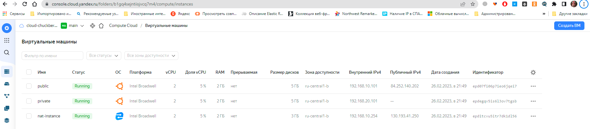

# Домашнее задание к занятию "15.1. Организация сети"

## Задание 1. Яндекс.Облако (обязательное к выполнению)

1. Создать VPC.
- Создать пустую VPC. Выбрать зону.
2. Публичная подсеть.
- Создать в vpc subnet с названием public, сетью 192.168.10.0/24.
- Создать в этой подсети NAT-инстанс, присвоив ему адрес 192.168.10.254. В качестве image_id использовать fd80mrhj8fl2oe87o4e1
- Создать в этой публичной подсети виртуалку с публичным IP и подключиться к ней, убедиться что есть доступ к интернету.
3. Приватная подсеть.
- Создать в vpc subnet с названием private, сетью 192.168.20.0/24.
- Создать route table. Добавить статический маршрут, направляющий весь исходящий трафик private сети в NAT-инстанс
- Создать в этой приватной подсети виртуалку с внутренним IP, подключиться к ней через виртуалку, созданную ранее и убедиться что есть доступ к интернету


### Ответ:

Так как данных для terraform не много, сделал все в одном фале [main.tf](main.tf)

Вывод `terraform apply`

<details>
<summary>Вывод из консоли.</summary>

```tf
vagrant@vagrant:~/netology-15-clouds-01-networking$ terraform apply
yandex_vpc_network.default: Refreshing state... [id=enpimuqrj94mrqco7rtb]
yandex_vpc_route_table.lab-rt-a: Refreshing state... [id=enpsbnv8leaunbedcnb7]
yandex_vpc_subnet.public: Refreshing state... [id=e2lreaq20j2rj5i0k3js]
yandex_vpc_subnet.private: Refreshing state... [id=e2l8vf41g004rrm18ifa]
yandex_compute_instance.nat-instance: Refreshing state... [id=epd5jeftqgngoq3d6094]
yandex_compute_instance.vm-1: Refreshing state... [id=epd7v6rjh5l5an81rqi9]
yandex_compute_instance.vm-2: Refreshing state... [id=epdjg7llcqibh9couhan]

Note: Objects have changed outside of Terraform

Terraform detected the following changes made outside of Terraform since the last "terraform apply":

  # yandex_compute_instance.nat-instance has been deleted
  - resource "yandex_compute_instance" "nat-instance" {
      - created_at                = "2023-02-26T17:50:47Z" -> null
      - folder_id                 = "b1gq4sejntiisjvcq7m4" -> null
      - fqdn                      = "epd5jeftqgngoq3d6094.auto.internal" -> null
      - hostname                  = "epd5jeftqgngoq3d6094" -> null
      - id                        = "epd5jeftqgngoq3d6094" -> null
      - labels                    = {} -> null
      - metadata                  = {
          - "ssh-keys" = <<-EOT
                vagrant:ssh-rsa 
                
            EOT
        } -> null
      - name                      = "nat-instance" -> null
      - network_acceleration_type = "standard" -> null
      - platform_id               = "standard-v1" -> null
      - status                    = "running" -> null
      - zone                      = "ru-central1-b" -> null

      - boot_disk {
          - auto_delete = true -> null
          - device_name = "epdfol61vs4s9a86krvn" -> null
          - disk_id     = "epdfol61vs4s9a86krvn" -> null
          - mode        = "READ_WRITE" -> null

          - initialize_params {
              - block_size = 4096 -> null
              - image_id   = "fd80mrhj8fl2oe87o4e1" -> null
              - size       = 3 -> null
              - type       = "network-hdd" -> null
            }
        }

      - network_interface {
          - index              = 0 -> null
          - ip_address         = "192.168.10.254" -> null
          - ipv4               = true -> null
          - ipv6               = false -> null
          - mac_address        = "d0:0d:59:b9:fd:d4" -> null
          - nat                = true -> null
          - nat_ip_address     = "158.160.0.240" -> null
          - nat_ip_version     = "IPV4" -> null
          - security_group_ids = [] -> null
          - subnet_id          = "e2lreaq20j2rj5i0k3js" -> null
        }

      - placement_policy {}

      - resources {
          - core_fraction = 100 -> null
          - cores         = 2 -> null
          - gpus          = 0 -> null
          - memory        = 2 -> null
        }

      - scheduling_policy {
          - preemptible = false -> null
        }
    }

  # yandex_compute_instance.vm-1 has been deleted
  - resource "yandex_compute_instance" "vm-1" {
      - created_at                = "2023-02-26T18:24:19Z" -> null
      - folder_id                 = "b1gq4sejntiisjvcq7m4" -> null
      - fqdn                      = "epd7v6rjh5l5an81rqi9.auto.internal" -> null
      - hostname                  = "epd7v6rjh5l5an81rqi9" -> null
      - id                        = "epd7v6rjh5l5an81rqi9" -> null
      - metadata                  = {
          - "user-data" = <<-EOT
                #cloud-config
                users:
                  - name: vagrant
                    groups: sudo
                    shell: /bin/bash
                    sudo: ['ALL=(ALL) NOPASSWD:ALL']
                    ssh-authorized-keys:
                      - ssh-rsa 
                      
            EOT
        } -> null
      - name                      = "public" -> null
      - network_acceleration_type = "standard" -> null
      - platform_id               = "standard-v1" -> null
      - status                    = "running" -> null
      - zone                      = "ru-central1-b" -> null

      - boot_disk {
          - auto_delete = true -> null
          - device_name = "epd3v6u2umpem7c1sqnr" -> null
          - disk_id     = "epd3v6u2umpem7c1sqnr" -> null
          - mode        = "READ_WRITE" -> null

          - initialize_params {
              - block_size = 4096 -> null
              - image_id   = "fd8gnpl76tcrdv0qsfko" -> null
              - size       = 5 -> null
              - type       = "network-hdd" -> null
            }
        }

      - network_interface {
          - index              = 0 -> null
          - ip_address         = "192.168.10.101" -> null
          - ipv4               = true -> null
          - ipv6               = false -> null
          - mac_address        = "d0:0d:7f:9b:73:89" -> null
          - nat                = true -> null
          - nat_ip_address     = "84.252.140.178" -> null
          - nat_ip_version     = "IPV4" -> null
          - security_group_ids = [] -> null
          - subnet_id          = "e2lreaq20j2rj5i0k3js" -> null
        }

      - placement_policy {}

      - resources {
          - core_fraction = 100 -> null
          - cores         = 2 -> null
          - gpus          = 0 -> null
          - memory        = 2 -> null
        }

      - scheduling_policy {
          - preemptible = false -> null
        }
    }

  # yandex_compute_instance.vm-2 has been deleted
  - resource "yandex_compute_instance" "vm-2" {
      - created_at                = "2023-02-26T18:24:19Z" -> null
      - folder_id                 = "b1gq4sejntiisjvcq7m4" -> null
      - fqdn                      = "epdjg7llcqibh9couhan.auto.internal" -> null
      - hostname                  = "epdjg7llcqibh9couhan" -> null
      - id                        = "epdjg7llcqibh9couhan" -> null
      - metadata                  = {
          - "user-data" = <<-EOT
                #cloud-config
                users:
                  - name: vagrant
                    groups: sudo
                    shell: /bin/bash
                    sudo: ['ALL=(ALL) NOPASSWD:ALL']
                    ssh-authorized-keys:
                      - ssh-rsa 
                      
            EOT
        } -> null
      - name                      = "private" -> null
      - network_acceleration_type = "standard" -> null
      - platform_id               = "standard-v1" -> null
      - status                    = "running" -> null
      - zone                      = "ru-central1-b" -> null

      - boot_disk {
          - auto_delete = true -> null
          - device_name = "epdt5epkd4qmki184r7o" -> null
          - disk_id     = "epdt5epkd4qmki184r7o" -> null
          - mode        = "READ_WRITE" -> null

          - initialize_params {
              - block_size = 4096 -> null
              - image_id   = "fd8gnpl76tcrdv0qsfko" -> null
              - size       = 5 -> null
              - type       = "network-hdd" -> null
            }
        }

      - network_interface {
          - index              = 0 -> null
          - ip_address         = "192.168.20.101" -> null
          - ipv4               = true -> null
          - ipv6               = false -> null
          - mac_address        = "d0:0d:13:81:eb:56" -> null
          - nat                = false -> null
          - security_group_ids = [] -> null
          - subnet_id          = "e2l8vf41g004rrm18ifa" -> null
        }

      - placement_policy {}

      - resources {
          - core_fraction = 100 -> null
          - cores         = 2 -> null
          - gpus          = 0 -> null
          - memory        = 2 -> null
        }

      - scheduling_policy {
          - preemptible = false -> null
        }
    }

  # yandex_vpc_network.default has been deleted
  - resource "yandex_vpc_network" "default" {
      - created_at = "2023-02-26T17:25:13Z" -> null
      - folder_id  = "b1gq4sejntiisjvcq7m4" -> null
      - id         = "enpimuqrj94mrqco7rtb" -> null
      - labels     = {} -> null
      - name       = "default" -> null
      - subnet_ids = [
          - "e2l8vf41g004rrm18ifa",
          - "e2lreaq20j2rj5i0k3js",
        ] -> null
    }

  # yandex_vpc_route_table.lab-rt-a has been deleted
  - resource "yandex_vpc_route_table" "lab-rt-a" {
      - created_at = "2023-02-26T17:41:18Z" -> null
      - folder_id  = "b1gq4sejntiisjvcq7m4" -> null
      - id         = "enpsbnv8leaunbedcnb7" -> null
      - labels     = {} -> null
      - network_id = "enpimuqrj94mrqco7rtb" -> null

      - static_route {
          - destination_prefix = "0.0.0.0/0" -> null
          - next_hop_address   = "192.168.10.254" -> null
        }
    }

  # yandex_vpc_subnet.private has been deleted
  - resource "yandex_vpc_subnet" "private" {
      - created_at     = "2023-02-26T17:25:14Z" -> null
      - folder_id      = "b1gq4sejntiisjvcq7m4" -> null
      - id             = "e2l8vf41g004rrm18ifa" -> null
      - labels         = {} -> null
      - name           = "private" -> null
      - network_id     = "enpimuqrj94mrqco7rtb" -> null
      - v4_cidr_blocks = [
          - "192.168.20.0/24",
        ] -> null
      - v6_cidr_blocks = [] -> null
      - zone           = "ru-central1-b" -> null
    }

  # yandex_vpc_subnet.public has been deleted
  - resource "yandex_vpc_subnet" "public" {
      - created_at     = "2023-02-26T17:25:14Z" -> null
      - folder_id      = "b1gq4sejntiisjvcq7m4" -> null
      - id             = "e2lreaq20j2rj5i0k3js" -> null
      - labels         = {} -> null
      - name           = "public" -> null
      - network_id     = "enpimuqrj94mrqco7rtb" -> null
      - v4_cidr_blocks = [
          - "192.168.10.0/24",
        ] -> null
      - v6_cidr_blocks = [] -> null
      - zone           = "ru-central1-b" -> null
    }


Unless you have made equivalent changes to your configuration, or ignored the relevant attributes using ignore_changes, the following plan may include actions to undo or respond to these changes.

────────────────────────────────────────────────────────────────────────────────────────────────────────────────────────────────────────────────────────────────────────────────────────────────────────────────────────────────────────────

Terraform used the selected providers to generate the following execution plan. Resource actions are indicated with the following symbols:
  + create

Terraform will perform the following actions:

  # yandex_compute_instance.nat-instance will be created
  + resource "yandex_compute_instance" "nat-instance" {
      + created_at                = (known after apply)
      + folder_id                 = (known after apply)
      + fqdn                      = (known after apply)
      + hostname                  = (known after apply)
      + id                        = (known after apply)
      + metadata                  = {
          + "ssh-keys" = <<-EOT
                vagrant:ssh-rsa AAAAB3NzaC1yc2EAAAADAQABAAABAQC6gDyT6NsUd9r4ac51FZvATxaIB0xxyqTUckMH6T7D0yibU7uWYbQ/8IJr1ildqHrY/eGWgiwSjgsCqVO7g1hc8CT7SJOiQgezElEhqbaA8dqzwxPQ/pjc+lWq59vrVgZwnRLFPMkgSIFsD84/gr7PDElrUGmGVZD8g39UMJaWlyizzOWlcEErxMWuN3shWcuqgoN0b0DonyqnSoNjLEme5RQEbZP2PVT5pjijY1xR2hf3nxXE7d0JS8u/mw08o35NxvU3UjYMchAak2hEa7+0/8xDPtU/1PooQE5DSINUqk0gzYD9NohYPMACDkthBU+lBMU0CUPo7bK0Q+kKBUXL vagrant@vagrant
            EOT
        }
      + name                      = "nat-instance"
      + network_acceleration_type = "standard"
      + platform_id               = "standard-v1"
      + service_account_id        = (known after apply)
      + status                    = (known after apply)
      + zone                      = "ru-central1-b"

      + boot_disk {
          + auto_delete = true
          + device_name = (known after apply)
          + disk_id     = (known after apply)
          + mode        = (known after apply)

          + initialize_params {
              + block_size  = (known after apply)
              + description = (known after apply)
              + image_id    = "fd80mrhj8fl2oe87o4e1"
              + name        = (known after apply)
              + size        = (known after apply)
              + snapshot_id = (known after apply)
              + type        = "network-hdd"
            }
        }

      + network_interface {
          + index              = (known after apply)
          + ip_address         = "192.168.10.254"
          + ipv4               = true
          + ipv6               = (known after apply)
          + ipv6_address       = (known after apply)
          + mac_address        = (known after apply)
          + nat                = true
          + nat_ip_address     = (known after apply)
          + nat_ip_version     = (known after apply)
          + security_group_ids = (known after apply)
          + subnet_id          = (known after apply)
        }

      + placement_policy {
          + placement_group_id = (known after apply)
        }

      + resources {
          + core_fraction = 5
          + cores         = 2
          + memory        = 2
        }

      + scheduling_policy {
          + preemptible = (known after apply)
        }
    }

  # yandex_compute_instance.vm-1 will be created
  + resource "yandex_compute_instance" "vm-1" {
      + created_at                = (known after apply)
      + folder_id                 = (known after apply)
      + fqdn                      = (known after apply)
      + hostname                  = (known after apply)
      + id                        = (known after apply)
      + metadata                  = {
          + "user-data" = <<-EOT
                #cloud-config
                users:
                  - name: vagrant
                    groups: sudo
                    shell: /bin/bash
                    sudo: ['ALL=(ALL) NOPASSWD:ALL']
                    ssh-authorized-keys:
                      - ssh-rsa 
                      
            EOT
        }
      + name                      = "public"
      + network_acceleration_type = "standard"
      + platform_id               = "standard-v1"
      + service_account_id        = (known after apply)
      + status                    = (known after apply)
      + zone                      = "ru-central1-b"

      + boot_disk {
          + auto_delete = true
          + device_name = (known after apply)
          + disk_id     = (known after apply)
          + mode        = (known after apply)

          + initialize_params {
              + block_size  = (known after apply)
              + description = (known after apply)
              + image_id    = "fd8gnpl76tcrdv0qsfko"
              + name        = (known after apply)
              + size        = (known after apply)
              + snapshot_id = (known after apply)
              + type        = "network-hdd"
            }
        }

      + network_interface {
          + index              = (known after apply)
          + ip_address         = "192.168.10.101"
          + ipv4               = true
          + ipv6               = (known after apply)
          + ipv6_address       = (known after apply)
          + mac_address        = (known after apply)
          + nat                = true
          + nat_ip_address     = (known after apply)
          + nat_ip_version     = (known after apply)
          + security_group_ids = (known after apply)
          + subnet_id          = (known after apply)
        }

      + placement_policy {
          + placement_group_id = (known after apply)
        }

      + resources {
          + core_fraction = 5
          + cores         = 2
          + memory        = 2
        }

      + scheduling_policy {
          + preemptible = (known after apply)
        }
    }

  # yandex_compute_instance.vm-2 will be created
  + resource "yandex_compute_instance" "vm-2" {
      + created_at                = (known after apply)
      + folder_id                 = (known after apply)
      + fqdn                      = (known after apply)
      + hostname                  = (known after apply)
      + id                        = (known after apply)
      + metadata                  = {
          + "user-data" = <<-EOT
                #cloud-config
                users:
                  - name: vagrant
                    groups: sudo
                    shell: /bin/bash
                    sudo: ['ALL=(ALL) NOPASSWD:ALL']
                    ssh-authorized-keys:
                      - ssh-rsa 
                      
            EOT
        }
      + name                      = "private"
      + network_acceleration_type = "standard"
      + platform_id               = "standard-v1"
      + service_account_id        = (known after apply)
      + status                    = (known after apply)
      + zone                      = "ru-central1-b"

      + boot_disk {
          + auto_delete = true
          + device_name = (known after apply)
          + disk_id     = (known after apply)
          + mode        = (known after apply)

          + initialize_params {
              + block_size  = (known after apply)
              + description = (known after apply)
              + image_id    = "fd8gnpl76tcrdv0qsfko"
              + name        = (known after apply)
              + size        = (known after apply)
              + snapshot_id = (known after apply)
              + type        = "network-hdd"
            }
        }

      + network_interface {
          + index              = (known after apply)
          + ip_address         = "192.168.20.101"
          + ipv4               = true
          + ipv6               = (known after apply)
          + ipv6_address       = (known after apply)
          + mac_address        = (known after apply)
          + nat                = false
          + nat_ip_address     = (known after apply)
          + nat_ip_version     = (known after apply)
          + security_group_ids = (known after apply)
          + subnet_id          = (known after apply)
        }

      + placement_policy {
          + placement_group_id = (known after apply)
        }

      + resources {
          + core_fraction = 5
          + cores         = 2
          + memory        = 2
        }

      + scheduling_policy {
          + preemptible = (known after apply)
        }
    }

  # yandex_vpc_network.default will be created
  + resource "yandex_vpc_network" "default" {
      + created_at                = (known after apply)
      + default_security_group_id = (known after apply)
      + folder_id                 = (known after apply)
      + id                        = (known after apply)
      + labels                    = (known after apply)
      + name                      = "default"
      + subnet_ids                = (known after apply)
    }

  # yandex_vpc_route_table.lab-rt-a will be created
  + resource "yandex_vpc_route_table" "lab-rt-a" {
      + created_at = (known after apply)
      + folder_id  = (known after apply)
      + id         = (known after apply)
      + labels     = (known after apply)
      + network_id = (known after apply)

      + static_route {
          + destination_prefix = "0.0.0.0/0"
          + next_hop_address   = "192.168.10.254"
        }
    }

  # yandex_vpc_subnet.private will be created
  + resource "yandex_vpc_subnet" "private" {
      + created_at     = (known after apply)
      + folder_id      = (known after apply)
      + id             = (known after apply)
      + labels         = (known after apply)
      + name           = "private"
      + network_id     = (known after apply)
      + route_table_id = (known after apply)
      + v4_cidr_blocks = [
          + "192.168.20.0/24",
        ]
      + v6_cidr_blocks = (known after apply)
      + zone           = "ru-central1-b"
    }

  # yandex_vpc_subnet.public will be created
  + resource "yandex_vpc_subnet" "public" {
      + created_at     = (known after apply)
      + folder_id      = (known after apply)
      + id             = (known after apply)
      + labels         = (known after apply)
      + name           = "public"
      + network_id     = (known after apply)
      + v4_cidr_blocks = [
          + "192.168.10.0/24",
        ]
      + v6_cidr_blocks = (known after apply)
      + zone           = "ru-central1-b"
    }

Plan: 7 to add, 0 to change, 0 to destroy.

Do you want to perform these actions?
  Terraform will perform the actions described above.
  Only 'yes' will be accepted to approve.

  Enter a value: yes

yandex_vpc_network.default: Creating...
yandex_vpc_network.default: Creation complete after 2s [id=enpjdnqrck0rks2viv1h]
yandex_vpc_subnet.public: Creating...
yandex_vpc_route_table.lab-rt-a: Creating...
yandex_vpc_subnet.public: Creation complete after 0s [id=e2ljr34nmm59qlracvoi]
yandex_compute_instance.vm-1: Creating...
yandex_compute_instance.nat-instance: Creating...
yandex_vpc_route_table.lab-rt-a: Creation complete after 1s [id=enpj67etgrovpc4qp9ak]
yandex_vpc_subnet.private: Creating...
yandex_vpc_subnet.private: Creation complete after 1s [id=e2lujm9hv2q8c6bvfchg]
yandex_compute_instance.vm-2: Creating...
yandex_compute_instance.vm-1: Still creating... [10s elapsed]
yandex_compute_instance.nat-instance: Still creating... [10s elapsed]
yandex_compute_instance.vm-2: Still creating... [10s elapsed]
yandex_compute_instance.vm-1: Still creating... [20s elapsed]
yandex_compute_instance.nat-instance: Still creating... [20s elapsed]
yandex_compute_instance.vm-2: Still creating... [20s elapsed]
yandex_compute_instance.nat-instance: Still creating... [30s elapsed]
yandex_compute_instance.vm-1: Still creating... [30s elapsed]
yandex_compute_instance.vm-2: Creation complete after 29s [id=epdegqv5is6l3ov7tgsb]
yandex_compute_instance.vm-1: Creation complete after 39s [id=epd07fi06p7ieo6jqei7]
yandex_compute_instance.nat-instance: Still creating... [40s elapsed]
yandex_compute_instance.nat-instance: Still creating... [50s elapsed]
yandex_compute_instance.nat-instance: Still creating... [1m0s elapsed]
yandex_compute_instance.nat-instance: Creation complete after 1m4s [id=epditcvu5itr7dk1dl56]

Apply complete! Resources: 7 added, 0 changed, 0 destroyed.
vagrant@vagrant:~/netology-15-clouds-01-networking$
```
</details>

Подключаемся к вирталке public и проверяем наличие интернета
```
vagrant@vagrant:~/netology-15-clouds-01-networking$ ssh 84.252.140.202
The authenticity of host '84.252.140.202 (84.252.140.202)' can't be established.
ECDSA key fingerprint is SHA256:aYN1DjBSACOBXtf0PqU+MMkzN3wX3iQpJNDgYnZJbAU.
Are you sure you want to continue connecting (yes/no/[fingerprint])? yes
Warning: Permanently added '84.252.140.202' (ECDSA) to the list of known hosts.
Welcome to Ubuntu 20.04.5 LTS (GNU/Linux 5.4.0-132-generic x86_64)

 * Documentation:  https://help.ubuntu.com
 * Management:     https://landscape.canonical.com
 * Support:        https://ubuntu.com/advantage

The programs included with the Ubuntu system are free software;
the exact distribution terms for each program are described in the
individual files in /usr/share/doc/*/copyright.

Ubuntu comes with ABSOLUTELY NO WARRANTY, to the extent permitted by
applicable law.

To run a command as administrator (user "root"), use "sudo <command>".
See "man sudo_root" for details.

vagrant@epd07fi06p7ieo6jqei7:~$ ping ya.ru
PING ya.ru (5.255.255.242) 56(84) bytes of data.
64 bytes from ya.ru (5.255.255.242): icmp_seq=1 ttl=251 time=5.05 ms
64 bytes from ya.ru (5.255.255.242): icmp_seq=2 ttl=251 time=37.6 ms
64 bytes from ya.ru (5.255.255.242): icmp_seq=3 ttl=251 time=4.81 ms
^C
--- ya.ru ping statistics ---
3 packets transmitted, 3 received, 0% packet loss, time 2008ms
rtt min/avg/max/mdev = 4.810/15.828/37.623/15.411 ms
vagrant@epd07fi06p7ieo6jqei7:~$
```

Подключаемся к виртуалке private, проверяем наличие интернета и то, что он ижет через nat-instance
```
vagrant@epd07fi06p7ieo6jqei7:~$ ssh 192.168.20.101
Welcome to Ubuntu 20.04.5 LTS (GNU/Linux 5.4.0-132-generic x86_64)

 * Documentation:  https://help.ubuntu.com
 * Management:     https://landscape.canonical.com
 * Support:        https://ubuntu.com/advantage

The programs included with the Ubuntu system are free software;
the exact distribution terms for each program are described in the
individual files in /usr/share/doc/*/copyright.

Ubuntu comes with ABSOLUTELY NO WARRANTY, to the extent permitted by
applicable law.

To run a command as administrator (user "root"), use "sudo <command>".
See "man sudo_root" for details.

vagrant@epdegqv5is6l3ov7tgsb:~$ ping ya.ru
PING ya.ru (77.88.55.242) 56(84) bytes of data.
64 bytes from ya.ru (77.88.55.242): icmp_seq=1 ttl=249 time=3.51 ms
64 bytes from ya.ru (77.88.55.242): icmp_seq=2 ttl=249 time=5.29 ms
^C
--- ya.ru ping statistics ---
2 packets transmitted, 2 received, 0% packet loss, time 1002ms
rtt min/avg/max/mdev = 3.514/4.401/5.288/0.887 ms
vagrant@epdegqv5is6l3ov7tgsb:~$ traceroute ya.ru
traceroute to ya.ru (5.255.255.242), 30 hops max, 60 byte packets
 1  _gateway (192.168.20.1)  0.575 ms  0.532 ms  0.509 ms
 2  * * *
 3  * * *
 4  ya.ru (5.255.255.242)  8.228 ms  8.210 ms  8.163 ms
vagrant@epdegqv5is6l3ov7tgsb:~$
```


